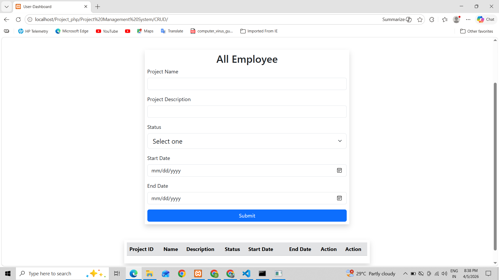
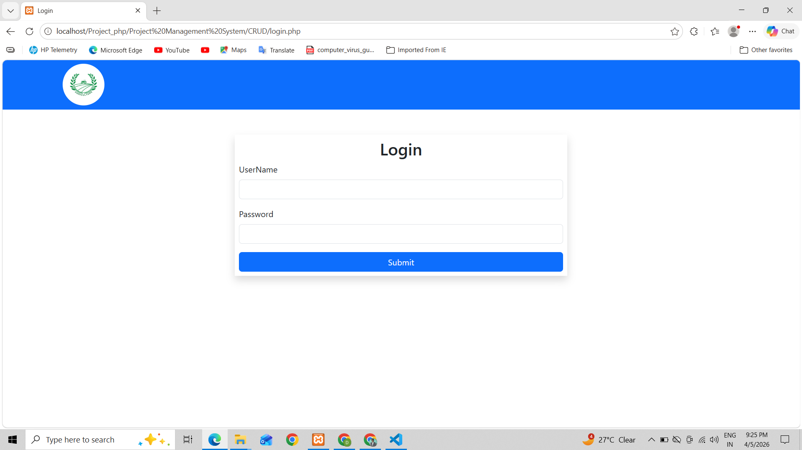
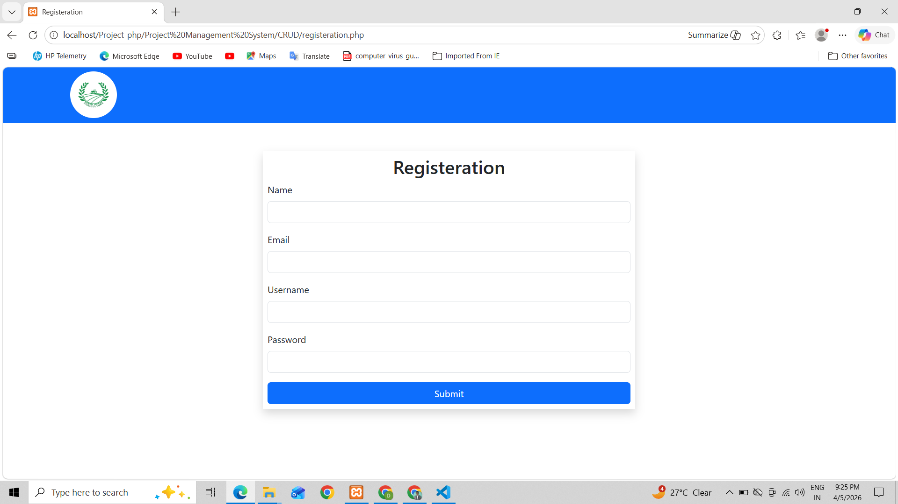
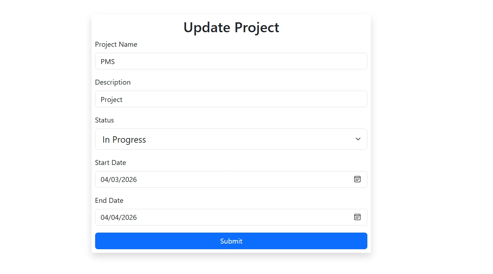
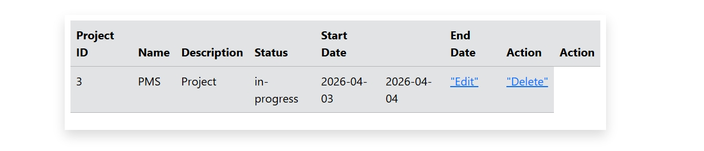
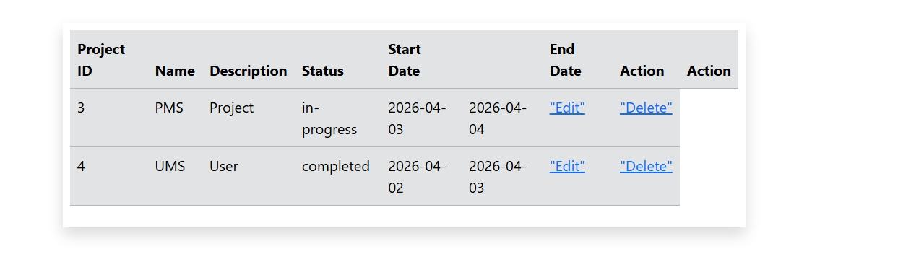

# PMS_Final
New Project on Frontend (PHP) - Project Management System

---

# 👨‍💻 Project Management System

Project Management System is a simple **web-based Project Management interface project** where users can explore different pages such as home, edit, delete, login, and register.
The project is built using **basic web technologies like HTML and CSS** and demonstrates the structure of a Project Management/browsing system.

---

## 📂 Project Structure

```
Project Management System
│
├── img/
│   ├── before_delete.jpeg
│   ├── delete.jpeg
│   ├── insert.png
│   ├── login.png
│   ├── register.png
│   └── update.jpeg
│
├── db.php
├── delete.php
├── edit.php
├── index.php
├── login.php
├── logout.php
└── registeration.html
```

---

## 📄 Pages Description

🏠 **index.php**
Main landing page of the website.

ℹ️ **edit.php**
Provides information about the to update Project.

🔐 **login.php**
Login page for registered users.

🗑 **delete.php**
Displays available deleted project. 

---

## 🖥️ Screenshots

### 🏠 Home Page



### 🔐 Login Page



### 📝 Register Page



### 📄 Update Page



### 📄 Delete Details



### 📞 Show Page



---

## 🛠️ Technologies Used

* 🌐 HTML
* 🎨 CSS
* 🎨 Bootstrap
* 💻 PHP
* 🖼️ Images for UI Design

---

## ▶️ How to Run the Project

1️⃣ Download or clone the repository
2️⃣ Open the project folder in **VS Code** or any code editor
3️⃣ Open **index.php** in your browser
4️⃣ Navigate through different pages

---

## 🎯 Purpose of the Project

This project demonstrates a **basic Project Management System website interface** where users can explore CRUD Operation with different sections of the site.

It can be extended into a **complete Project Management system** in the future.

---
